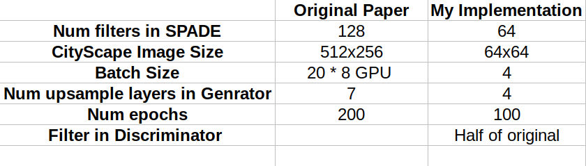

[](https://paperswithcode.com/sota/image-to-image-translation-on-ade20k-labels?p=semantic-image-synthesis-with-spatially)
[](https://paperswithcode.com/sota/image-to-image-translation-on-ade20k-outdoor?p=semantic-image-synthesis-with-spatially)
[](https://paperswithcode.com/sota/image-to-image-translation-on-cityscapes?p=semantic-image-synthesis-with-spatially)
[](https://paperswithcode.com/sota/image-to-image-translation-on-coco-stuff?p=semantic-image-synthesis-with-spatially)

# Implementation of Semantic Image Synthesis with Spatially-Adaptive Normalization (SPADE) in PyTorch
PyTorch unofficial implementation of Semantic Image Synthesis with Spatially-Adaptive Normalization paper by Nvidia Research.

My blog post can be found here, [SPADE: State of the art in Image-to-Image Translation by Nvidia](https://medium.com/@kushajreal/spade-state-of-the-art-in-image-to-image-translation-by-nvidia-bb49f2db2ce3)

### [project page](https://nvlabs.github.io/SPADE/) |   [paper](https://arxiv.org/abs/1903.07291) | [GTC 2019 demo](https://youtu.be/p5U4NgVGAwg) | [Youtube](https://youtu.be/MXWm6w4E5q0)

# Overview


In many common normalization techniques such as Batch Normalization (<a href="[https://arxiv.org/abs/1502.03167](https://arxiv.org/abs/1502.03167)"><span style="font-weight:normal">Ioffe et al., 2015</span></a>), there are learned affine layers (as in <a href="[https://pytorch.org/docs/stable/nn.html?highlight=batchnorm2d#torch.nn.BatchNorm2d](https://pytorch.org/docs/stable/nn.html?highlight=batchnorm2d#torch.nn.BatchNorm2d)"><span style="font-weight:normal">PyTorch</span></a> and <a href="[https://www.tensorflow.org/api_docs/python/tf/layers/batch_normalization](https://www.tensorflow.org/api_docs/python/tf/layers/batch_normalization)"><span style="font-weight:normal">TensorFlow</span></a>) that are applied after the actual normalization step. In SPADE, the affine layer is <i>learned from semantic segmentation map</i>. This is similar to Conditional Normalization (<a href="[https://arxiv.org/abs/1707.00683](https://arxiv.org/abs/1707.00683)"><span style="font-weight:normal">De Vries et al., 2017</span></a> and <a href="[https://arxiv.org/abs/1610.07629](https://arxiv.org/abs/1610.07629)"><span style="font-weight:normal">Dumoulin et al., 2016</span></a>), except that the learned affine parameters now need to be spatially-adaptive, which means we will use different scaling and bias for each semantic label. Using this simple method, semantic signal can act on all layer outputs, unaffected by the normalization process which may lose such information. Moreover, because the semantic information is provided via SPADE layers, random latent vector may be used as input to the network, which can be used to manipulate the style of the generated images.

# Overview of Repo
All the code for the repo can be found in the src-folder.

```python
└── src
    ├── dataloader
    │   ├── cityscapes.py
    ├── models
    │   ├── spade.py
    │   ├── spade_resblk.py
    │   ├── generator.py
    │   ├── discriminator.py
    │   ├── encoder.py
    │   ├── ganloss.py
    │   └── weights_init.py
    ├── notebooks
    │   ├── develpment.ipynb
    │   ├── dis.pth
    │   ├── gen.pth
    │   ├── Images
    │   └── train_model.ipynb
    ├── args.py
    ├── plot.py
    └── train.py

```
* In `args.py` you will find the get_parser and you can set various defaults here.
* In `train.py` I provide the train script to train your model. (I recommend using train_model.ipynb notebook for training your model, as I present complete model training process there)
* In `plot.py` you will find various plotting functions, which are used in the notebooks also.
* In `models` folder there are model definitions of all the models discussed in the paper. They are built so as to resemble the paper architectures.
* In `notebooks` folder, there are two notebooks, `development.ipynb` which I used when debugging my model architectures. And in `train_model.ipynb` I make an actual model from scratch and train it, so if you want to make your own model, follow this notebook.

# Results
Comparison of original model and my model



I was limited by my hardware so I changed my motive to being able to reproduce images that show that the model works. (Note:- I did not train my model completely, below are results after every 20 epochs)


After 80 epochs, we can get a sense that we are able to get real life pictures. Also, after downsampling the original CityScape images, they were blurry themselves so some bluriness in the output is expected (By bluriness I am saying we have to print pictures very small to show without being blurred).

# Issues
If some documentation is missing or some piece of code is not clear, open an issue and I would be happy to clarify. Also, if any bug is found, file a PR or open an issue. If you want some genral discussion, I am always open to discussion.

# License
This repo is MIT licensed, as found in the LICENSE file.
